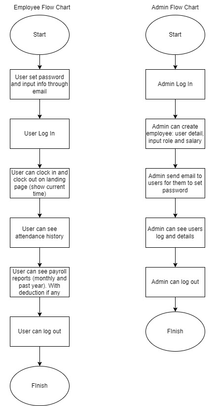
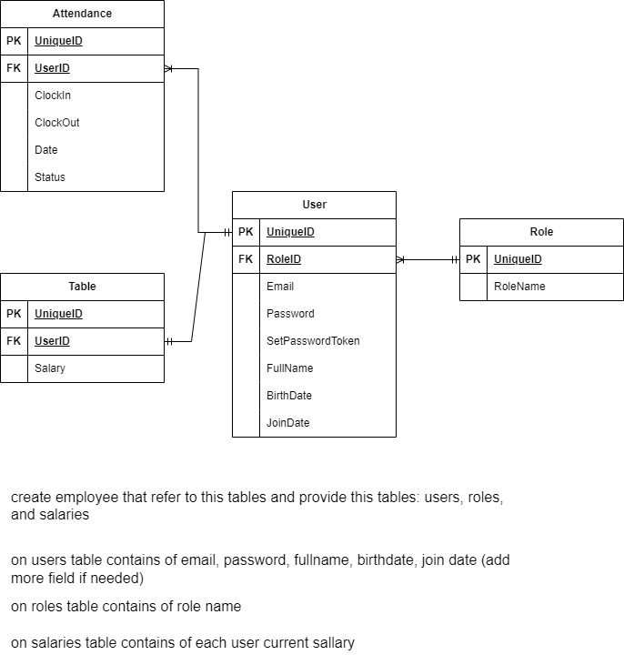

# Purwadhika Selection Test: Attendance System Web App

This is monorepo contain frontend project using ReactJS and backend project using ExpressJS. Project description read below.

## Available Scripts

In the project directory, you can run:

### `npm start`

Runs the app in the development mode.

Open [http://localhost:3000](http://localhost:3000) to view it in the browser.

For API, you can access it in [http://localhost:8000/api](http://localhost:8000/api).

The page will reload if you make edits.

### `npm run clean`

Remove `node_modules` folder from all project.

### `npm run build`

Builds the app for production to the `build` folder.

### `npm run serve`

Runs the app in the production mode.

### `npm run client`

Run command on client project.

### `npm run install:client`

Install dependency in client project. Use `npm install:client:dev` for dev dependencies.

### `npm run server`

Run command on server project.

### `npm run install:server`

Install dependency in server project. Use `npm install:server:dev` for dev dependencies.

## What The Project Is About
The requirement of this project is to create an attendance system for employees to clock in and clock out during their working hours. An employee account is created by the admin, and from there employees could set their own password and log in to the app. Inside the app, employees are able to log their attendance (clock in and clock out), and they are able to view their attendance history and also their monthly payroll records during the last year. Conditions such as when an employee did not clock out or did not clock in at all, his or her monthly payroll will be cut accordingly.

## My Approach
I started out with creating flow charts, just to get a picture of the flow from the admin side and from the employee side. 

after that I went on to create wireframes, both for admin and employee. I made wireframes in mobile size and desktop size.
https://www.figma.com/file/IXI6kiUJ64AVMVr5iWQFky/Selection-Test?type=design&node-id=1%3A3&mode=design&t=PNV8CAgnsdFDJSi5-1

I came up with the idea of naming the app Attendee, as it is for employees to record their attendance. The logo has a person in it signaling an employee, and the negative space reflects the letter A, for Attendee.

After that, I created an entity relationship diagram to help me visualize the database.

## How The App Works
Here's the final output of my approach in working on this project.

### Admin Creates An Account for A New Employee
By creating an admin role from seeders, I can log in as an admin and create a new account for an employee. I do that by setting a salary and send an email for them to create a password.

### Employee Sets A Password and Log in as an Employee
Once the employee has set a password from the email given, he can log in as an employee

### Employee can Clock In and Clock Out
I made a function that creates a new attendance log for each user at every midnight. So everyday there's a new log for each employee. Each employee could then clock in, and the clock in time is set for that day. Once they clocked in, they can't clock in again. At the end of the day, they can clock out and the clock out time is set for that day. The state of the clock in and clock out button also resets at midnight, giving them the chance to do it again for the next day

### Employee Can See Their Attendance Log
I made a page for them to see their attendance history, including pagination, filtering and sorting features

### Employee Can See Their Monthly Payroll Records of the Last 12 Months
I made a page that collects the attendance data for the past year and display their monthly salary based on their attendance. Calculations are made accordingly each month and the total payroll for that month is displayed

I made the application responsive in two screen sizes: mobile and desktop screens. Overall, that concludes of what the application could do. I did this project based on my own approach, and I realize that there is much to improve. Hope you enjoy, thank you for reading! 